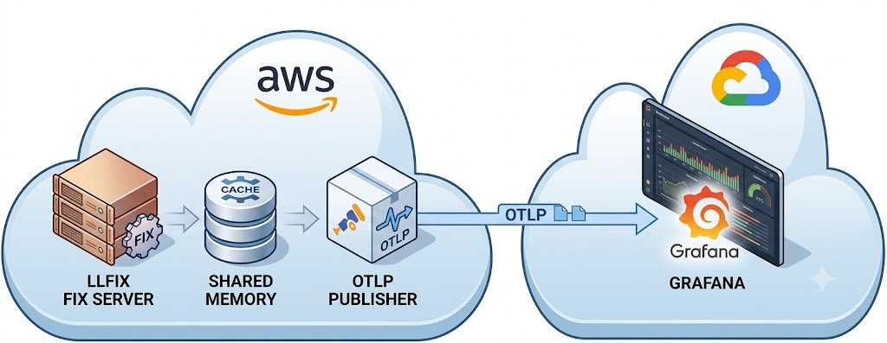

# llfix Live Cloud Demo

This repository contains the live cloud demo for llfix.

The llfix FIX server is publicly accessible and runs continuously on a basic AWS EC2 instance with limited CPU and memory resources. This demonstrates llfix's efficiency and suitability for always-on 24/7 trading systems, where predictable resource usage and long-term stability are critical.

A public Grafana dashboard provides real-time server statistics, including process RSS memory usage and uptime. The dashboard demonstrates llfix's low memory footprint and operational stability during continuous operation.

The demo is intentionally deployed on a minimal cloud environment rather than dedicated high-performance hardware, showing that llfix can deliver low resource consumption even on constrained infrastructure.



You can view the public Grafana dashboard here:

https://gallantgravy37.grafana.net/public-dashboards/86bfd130cd0a4b9fac04e49942a07209

Note that metric updates may take a short while to appear in Grafana.

The FIX server responds to all incoming NewOrderSingle messages (35=D) with fully filled ExecutionReport messages (35=8).

To connect to the server and send orders, you can use the session details below:

| Parameter                           | Value                                                           |
|-------------------------------------|-----------------------------------------------------------------|
| IP                                  | 13.41.188.117                                                   |
| Port                                | 5030                                                            |
| Target Comp ID                      | EXECUTOR                                                        |
| Defined client comp ids you can use | CLIENT1 CLIENT2 CLIENT3 CLIENT4 CLIENT5 CLIENT6 CLIENT7 CLIENT8 |
| Logon message reset flag            | 141=Y (ResetSeqNumFlag=Y)                                       | 


Alternatively, you can use the 'clients' application in this repository to connect to the server and send orders.

To build it:

1. git clone https://github.com/CorewareLtd/llfix.git
2. Copy the 'clients' folder into the examples directory
3. cd into examples/clients directory
4. To build:

```bash
mkdir build
cd build
cmake ..
make
```

For any questions, please contact us at enquiries@llfix.net.